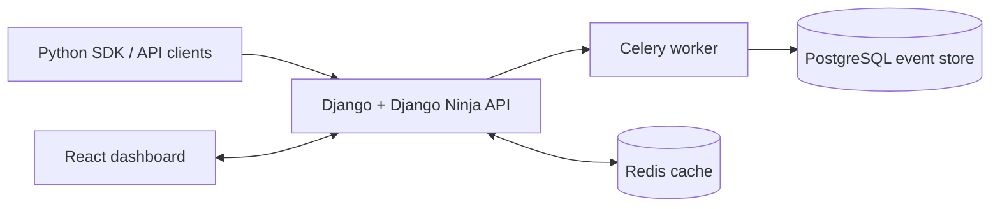
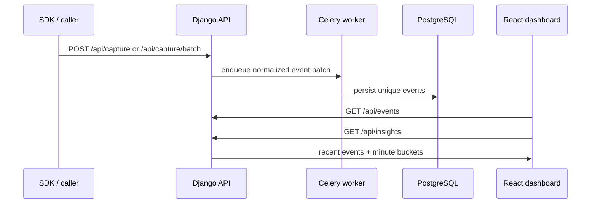

# TelemetryTaco

<div align="center">

Lightweight, self-hosted telemetry for queued event ingestion, live event inspection, and minute-level insights.

[](https://github.com/Agile-Flimflam/TelemetryTaco/actions/workflows/cicd.yml)


[Quick Start](#quick-start) • [Architecture](#architecture) • [Usage](#usage) • [Repo](#repo)

</div>

## Why It Exists

- Queued batch ingestion with idempotent event persistence.
- Live recent-event streaming plus minute-level insight aggregates.
- OpenAPI-generated frontend types across a tested monorepo.

## Architecture


```mermaid
flowchart LR
    A[Python SDK / API clients] --> B[Django + Django Ninja API]
    B --> C[Celery worker]
    B <--> D[(Redis cache)]
    C --> E[(PostgreSQL event store)]
    F[React dashboard] <--> B
```


```mermaid
sequenceDiagram
    participant Client as SDK / caller
    participant API as Django API
    participant Worker as Celery worker
    participant DB as PostgreSQL
    participant UI as React dashboard

    Client->>API: POST /api/capture or /api/capture/batch
    API->>Worker: enqueue normalized event batch
    Worker->>DB: persist unique events
    UI->>API: GET /api/events
    UI->>API: GET /api/insights
    API->>UI: recent events + minute buckets
```

## Quick Start

Prereqs: Python 3.11-3.13, Poetry, pnpm, Docker.

```bash
pnpm install
cp backend/.env.example backend/.env
pnpm services
pnpm dev
# optional
pnpm seed
```

Local endpoints:

- Frontend: `http://localhost:5173`
- API: `http://localhost:8000`

`pnpm dev` runs the Django API, Celery worker, and Vite frontend. Seed data is available through `pnpm seed` or `pnpm seed:clean`.

## Usage

Python SDK:

```python
from telemetry_taco import TelemetryTaco

with TelemetryTaco(base_url="http://localhost:8000") as client:
    client.capture(
        distinct_id="user-123",
        event_name="feature_used",
        properties={"feature_name": "insights-refresh"},
    )
```

Batch capture:

```bash
curl -X POST http://localhost:8000/api/capture/batch \
  -H 'Content-Type: application/json' \
  -d '{"events":[{"distinct_id":"user-123","event_name":"page_view","properties":{"path":"/"}}]}'
```

API surface:

| Endpoint | Purpose |
| --- | --- |
| `POST /api/capture` | Capture one event |
| `POST /api/capture/batch` | Capture a batch of events |
| `GET /api/events` | Read the recent event feed |
| `GET /api/insights` | Read minute-level aggregates |
| `GET /api/health/live` | Liveness probe |
| `GET /api/health/ready` | Database and cache readiness |

## Repo

| Path | Responsibility |
| --- | --- |
| `backend/` | Django API, ingestion, Celery tasks, retention, tests |
| `frontend/` | React dashboard, React Query polling, generated API types |
| `sdk/` | Python client with background batching and flush-on-close |

Useful commands:

| Command | Purpose |
| --- | --- |
| `pnpm generate:api-types` | Export OpenAPI and regenerate frontend types |
| `pnpm validate:all` | Run backend, frontend, and SDK validation |
| `pnpm test` | Run backend, frontend, and SDK tests |
| `pnpm seed` | Seed realistic sample events |
| `pnpm stop` | Stop local app processes |

Deeper backend setup lives in [`backend/SETUP.md`](backend/SETUP.md).

## Non-Goals

TelemetryTaco is intentionally not solving multi-tenancy, auth, funnels, feature flags, or warehouse-scale analytics yet. The current repo is optimized for a strong ingestion-and-dashboard MVP with clean seams for future expansion.
